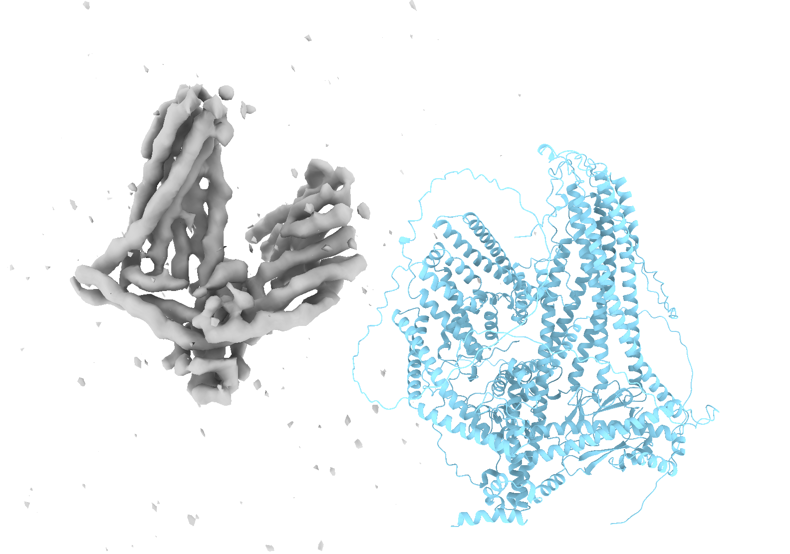
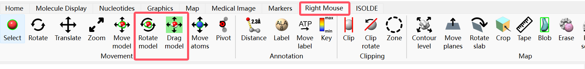
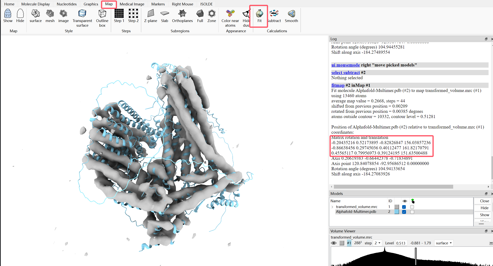
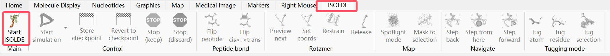
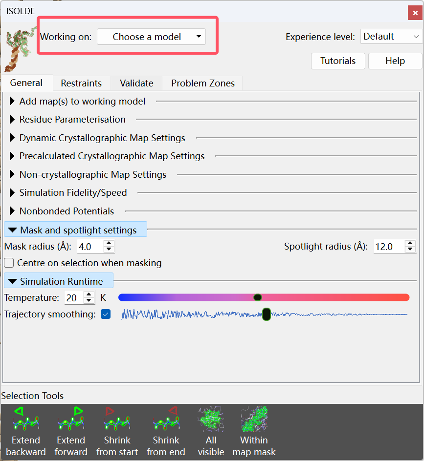
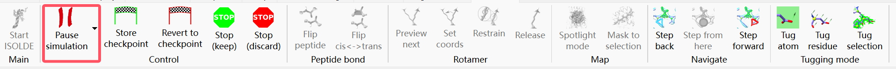

# CoCoFold

## Setting up CoCoFold
CoCoFold is based on OpenFold, so installing CoCoFold first requires installing OpenFold.
1. First ```git clone -b pl_upgrades https://github.com/aqlaboratory/openfold.git```, then ```cd openfold```
2. ```mamba create -f cocofold_env.yml --n cocofold``` (Use [cocofold_env.yml](./cocofold_env.yml) to replace ```environment.yml``` in the original OpenFold installation.)

   If mamba fails to install, use ```pip install deepspeed==0.12.4 dm-tree==0.1.6 git+https://github.com/NVIDIA/dllogger.git starfile==0.4.12 torch==2.3 torchvision==0.18 torchaudio==2.3 flash-attn==2.5.8``` instead, then activate the environment, e.g ```conda activate cocofold```
4. Run the setup script to configure kernels and folding resources.
   ```
   scripts/install_third_party_dependencies.sh
   ```
6. Prepend the conda environment to the ```$LD_LIBRARY_PATH``` and ```$LIBRARY_PATH```., e.g.
   ```export LIBRARY_PATH=$CONDA_PREFIX/lib:$LIBRARY_PATH export LD_LIBRARY_PATH=$CONDA_PREFIX/lib:$LD_LIBRARY_PATH```
7. Download parameters.
   ```
   ./scripts/download_alphafold_params.sh ./openfold/resources/
   ./scripts/download_openfold_params.sh ./openfold/resources/
   ./scripts/download_openfold_soloseq_params.sh ./openfold/resources/
   ```
8. `cd ..` and ```git clone https://github.com/paper-submission-2025/CoCoFold.git```

## How to Use CoCoFold: Case Study with PDB Entry 6ZBH
### Step 1: Run Alphafold to get initial prediction and structure module parameters.
1. Downloading sequence databases for performing multiple sequence alignments. OpenFold team provided a script to download the AlphaFold databases [here](https://github.com/aqlaboratory/openfold/blob/main/scripts/download_alphafold_dbs.sh).
2. Prepare the sequence data (.fasta file), for example, you can download 6ZBH.fasta [here](./example/6zbh_entry.fasta).
3. Run the script [run_pretrained_openfold.py](./src/run_pretrained_openfold.py) with
   ```
   python3 run_pretrained_openfold.py \
    $INPUT_FASTA_DIR \
    $TEMPLATE_MMCIF_DIR \
    --output_dir $PREDICTION_OUTPUT_DIR \
    --uniref90_database_path $BASE_DATA_DIR/uniref90/uniref90.fasta \
    --mgnify_database_path $BASE_DATA_DIR/mgnify/mgy_clusters_2022_05.fa \
    --pdb_seqres_database_path $BASE_DATA_DIR/pdb_seqres/pdb_seqres.txt \
    --uniref30_database_path $BASE_DATA_DIR/uniref30/UniRef30_2021_03 \
    --uniprot_database_path $BASE_DATA_DIR/uniprot/uniprot.fasta \
    --bfd_database_path $BASE_DATA_DIR/bfd/bfd_metaclust_clu_complete_id30_c90_final_seq.sorted_opt \
    --config_preset "model_1_multimer_v3" \
    --model_device "cuda:0" \
    --skip_relaxation \
    --jax_param_path $ALPHAFOLD_PARAMETERS_DIR/params/params_model_1_multimer_v3.npz \
    --model_dir $MODEL_PARAMETERS_OUTPUT_DIR \
   ```
   After that, you will get the [pre-computed alignments](./example/alignments). You don't need to compute that again when you want to perform model inference with another config_preset. You will also get the needed fine-tuning model parameters in `$MODEL_PARAMETERS_OUTPUT_DIR`.
   
   To perform model inference with pre-computed alignments, use the following command
   ```
   python3 run_pretrained_openfold.py \
    $INPUT_FASTA_DIR \
    $TEMPLATE_MMCIF_DIR \
    --output_dir  $PREDICTION_OUTPUT_DIR \
    --use_precomputed_alignments $PRECOMPUTED_ALIGNMENTS \
    --config_preset "model_1_multimer_v3" \
    --model_device "cuda:0" \
    --skip_relaxation \
    --jax_param_path $ALPHAFOLD_PARAMETERS_DIR/params/params_model_1_multimer_v3.npz \
    --model_dir $MODEL_PARAMETERS_OUTPUT_DIR \
   ```
### Step 2: Prepare cryo-EM particles data
Download EMPIAR-10437 (alternative conformation 5, ~23G). You can download it directly from the command line:
```
wget -nH -m ftp://ftp.ebi.ac.uk/empiar/world_availability/10437/data/particles/MSP1_altconf5/
```
This dataset contains 75,620 extracted particles with box size of 288 and pixel size of 1.073Å/pix.

CTF parameters and poses are in the metafile `MSP1_altconf5.star`.

To simulate limited particles cases, we used the `Particles Sets` tool in the CryoSPARC software to get 1,181 random particles. 

If you are concerned with high-resolution scenarios, we recommend using [CryoSieve](https://github.com/mxhulab/cryosieve) to filter out a small number of high-quality particles for subsequent model updates. Otherwise, using a large number of particles for model updates could destroy the well-pretrained structure of AlphaFold as the number of iterations increases.

### Step 3: Reconstruct the density map
Since the poses are known in this case, just use the `Reconstruction only` tool in the CryoSPARC software to reconstruct the density map with the 1,181 particles. 

Otherwise, you need first take `Ab-initio` tool to get a rough initial map and use `NU-Refine` tool to reconstruct the map.

CryoSPARC provides CS file, it needs to be converted into the STAR file format to facilitate downstream training. This conversion can be achieved using csparc2star.py from the [pyem](https://github.com/asarnow/pyem) (we already installed).
```
python csparc2star.py $CRYOSPARC_PATH/J69/J69_particles.cs $OUTPUT_DIR/69.star
```

### Step 4: Aligement the initial predicted model and reconstrution map
This step is completed manually using ChimeraX. One should be careful that the map may show chirality, which actually happend in this case.



To solve this, you need to filp the map by
```
python3 invert_z.py \
 --input_mrc $INPUT_MAP_DIR \
 --output_mrc $OUTPUI_MAP_DIR
```
then use the `drag` and `rotation` tool roughly fit the model into the map



and then use the `fit` tool to fit the model into the map more precisely.



You will get a affine matrix as the red box shown. Record it in a CSV file with 3 rows 4 columns and prepare a mask CSV file just consider a single element 0. 

If you fit the model into the map by chains, you need to record the affine matrices with 3*N rows, 4 columns. You'll also need to prepare an N-1 line mask CSV file, with each line recording the starting atom number for each chain. Note that the first line must be 0. Pay special attention to subtracting 1 from the ATOM NUMBER to align with Python array indexing. Additionally, be aware that TER records in PDB files occupy atom numbers, so for each additional chain, you'll need to subtract another 2 from the atom number.

### Step 5: Fine-tune Alphafold
Now we can fine-tune the Alphafold model with following command
```
python3 train.py \
 --star_data_dir $STAR_FILE_DIR/69.star \
 --mrc_data_dir $CRYOSPARC_DIR \
 --structure_dir $MODEL_PARAMETERS_OUTPUT_DIR/structure.pth \
 --head_dir $MODEL_PARAMETERS_OUTPUT_DIR/head.pth \
 --device0 'cuda:0' \
 --device1 'cuda:0' \
 --output_structure_dir $OUTPUT_STRUCTURE_DIR/struct_ \
 --output_model_dir $OUTPUT_GMM_DIR/model_ \
 --max_freq 1 \
 --boxsize 288 \
 --apix 1.073 \
 --resolution 3 \
 --sonly \
 --learn_width \
 --learn_weight \
 --invert_z \
 --affine_matrices_csv affine_matrices.csv \
 --mask_split_csv masks.csv \
 --epochs 10 \
 --batch_size 32 \
 --mini_batch_size 8 \
```
- `mrc_data_dir` is the path to the MRC file containing the particle data, it's just the `#CRYOSPARC_DIR` since we used `csparc2star` tool.
- If cuda is out of memory, decrease the mini_batch_size and try setting device1 'cuda:1'.
- invert_z is setting since we filped the reconsturction map before aligenment.

### Step 6: Get the final prediction
After training, you can get the predicted model and correspoding GMM map with following command
```
for n in {1..10}
do
    python3 get_pdb.py \
      --star_data_dir $STAR_FILE_DIR/69.star \
      --mrc_data_dir $CRYOSPARC_DIR \
      --structure_dir  $OUTPUT_STRUCTURE_DIR/struct_${n}.pth \
      --model_dir  $OUTPUT_GMM_DIR/model_${n}.pth \
      --head_dir $MODEL_PARAMETERS_OUTPUT_DIR/head.pth \
      --prot_dir $MODEL_PARAMETERS_OUTPUT_DIR/protein.pth \
      --device0 'cuda:0' \
      --device1 'cuda:0' \
      --output_dir $OUTPUT_PREDICTION_DIR/69_${n} \
      --apix 1.073 \
      --boxsize 288 \
      --resolution 3 \
      --sonly \
      --affine_matrices_csv affine_matrices.csv \
      --mask_split_csv masks.csv
done
```

### Step 7: Postprocess by filtering with plddt and relaxing with ISOLDE
To filter the model by plddt score, use the following command:
```
python3 plddt.py \
   --input_dir $INPUT_PDBS_DIR \
   --output_dir $OUTPUT_DIR \
   --threshold 30 \
```
Finally, download ISOLDE in ChimeraX (`Tools-More Tools..`)

Start by choosing your model.




Pause the simmulation after a few seconds.



Use the command follwing command to save the final relaxed model.
```
save 69_filter30_isolde.pdb #1.2 
```

